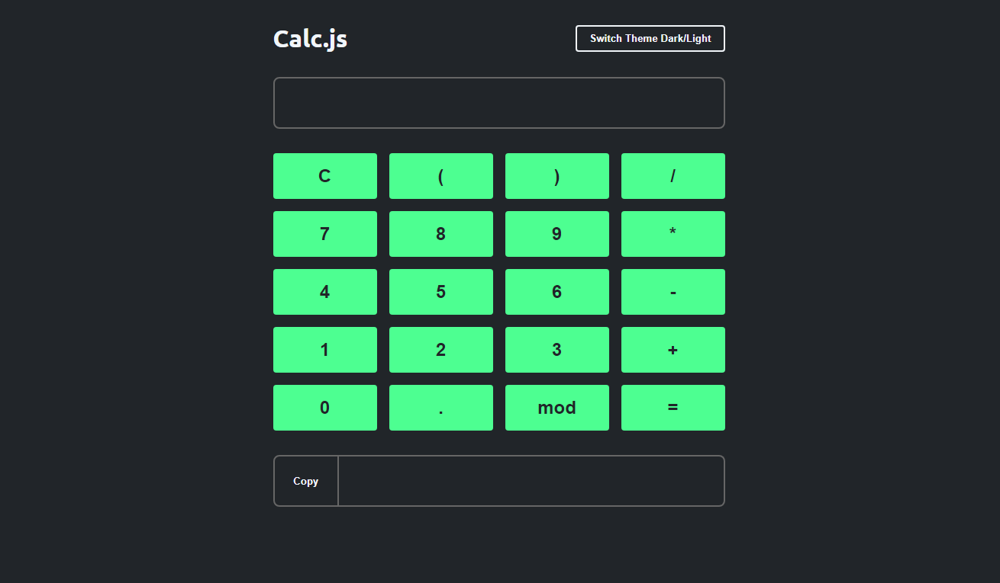
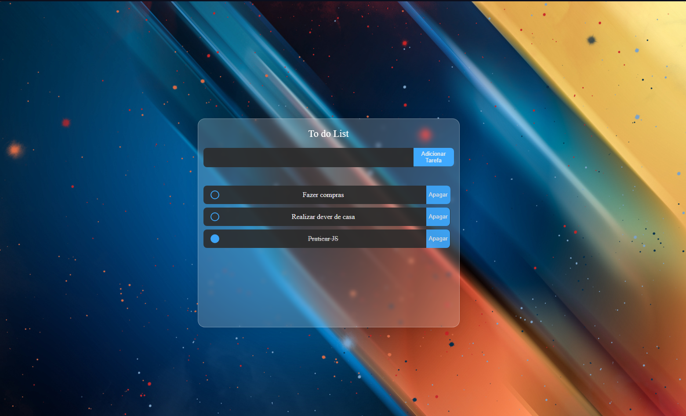
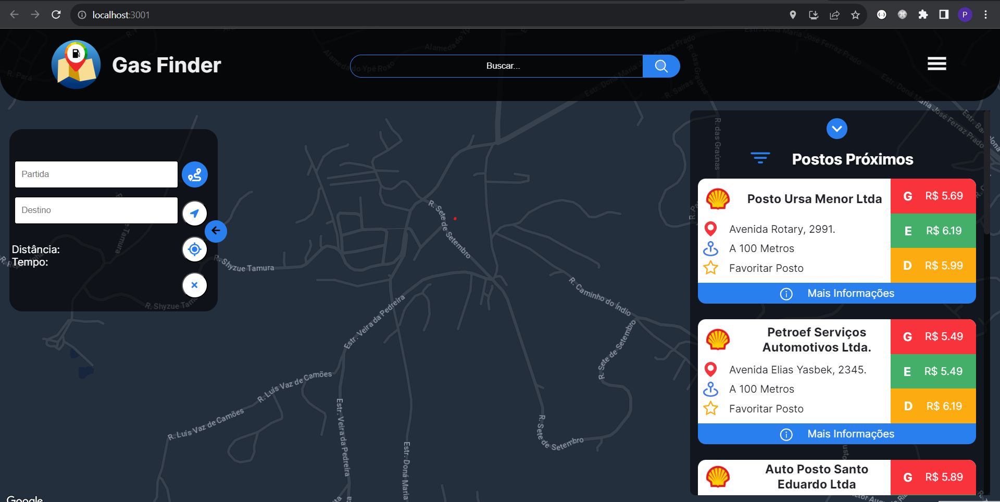

<div align="center">
  
  <h1>Olá, me chamo João Victor! 💻🚀</h1>
  <p>
    <a href="https://www.linkedin.com/in/joaovictorinacio" target="_blank">
      
    </a>
    <a href="mailto:j.inacio.s@hotmail.com" target="_blank">
      
    </a>
  </p>
</div>

## 💻👇 Sobre Mim
```javascript
const dev = {
  nome: "João Victor",
  stack: "Front-End",
  formacao: "Técnico em Desenvolvimento de Sistemas 🎓",
  foco: "Aprender novas tecnologias e obter mais experiência na área",
  hobbies: ["Café ☕", "Jogos 🎮", "Animes 👾"],
  meta: "Desenvolver soluções criativas e escaláveis"
};

console.log(`👋 ${dev.nome} | ${dev.stack}`);
```

## ⚡ Habilidades Técnicas
**Linguagens e Ferramentas:**  
<p align="left">
  <a href="https://developer.mozilla.org/en-US/docs/Web/HTML" target="_blank">
    
  </a>
  <a href="https://developer.mozilla.org/pt-BR/docs/Web/CSS" target="_blank">
    
  </a>
  <a href="https://reactjs.org/" target="_blank">
    
  </a>
  <a href="https://developer.mozilla.org/pt-BR/docs/Web/JavaScript" target="_blank"> 
      
  </a>
  <a href="https://dev.mysql.com/" target="_blank"> 
          
  </a>
  <a href="https://developer.mozilla.org/pt-BR/docs/Glossary/Python" target="_blank"> 
          
  </a>
  <a href="https://learn.microsoft.com/en-us/dotnet/csharp/" target="_blank"> 
          
  </a>
  <a href="https://www.figma.com/" target="_blank"> 
          
  </a>
</p>

---

## 🚀 Projetos em Destaque

| [**Calc JS**](https://github.com/J-Inacio/calculadoraJS-oneBitCode) | [**To-do List**](https://github.com/J-Inacio/to-do-list) | [**GasFinder**](https://github.com/J-Inacio/GasFinder) |
| :---: | :---: | :---: |
|  |  |  |
| Calculadora em JS | Lista de tarefas em JS | Encontra e consulta preço dos combustíveis |


---

## 📊 Estatísticas do GitHub
<div align="center">
  
  
</div>
