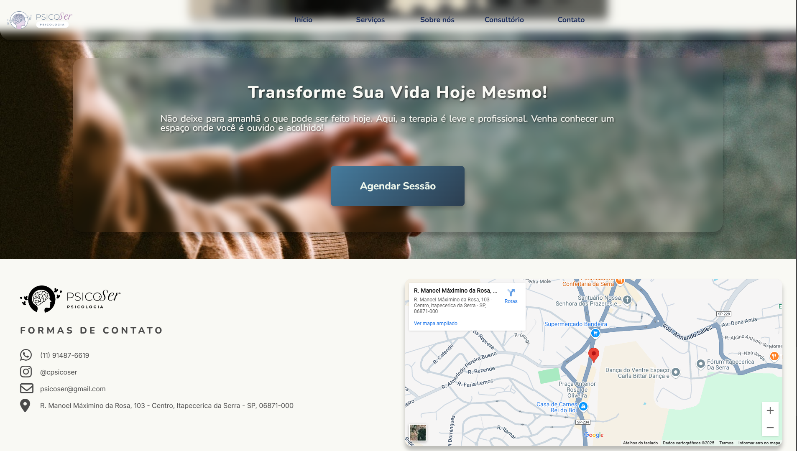
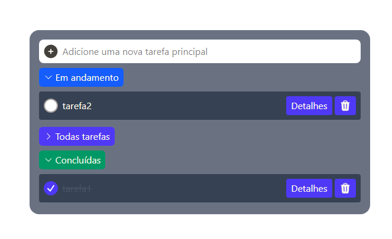
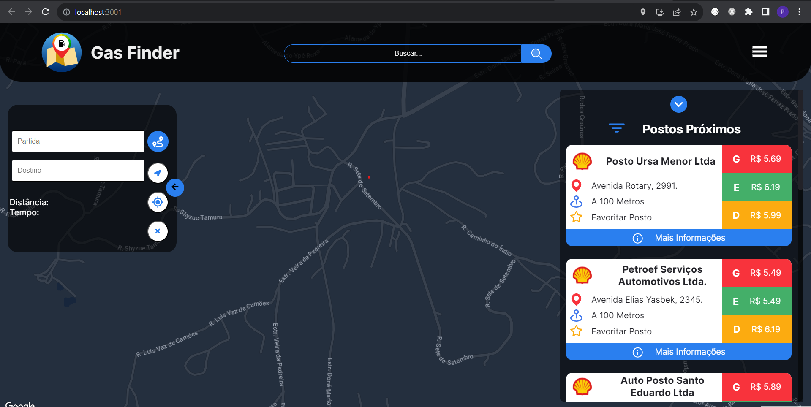
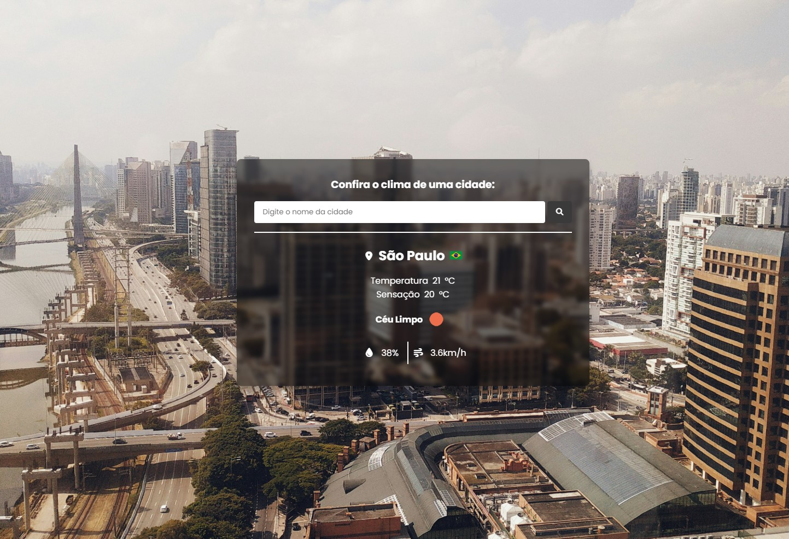

  <h1></h1>

 

Estudante de ADS na UniFECAF | Desenvolvedor Front-end focado em React, TypeScript e Node.js. Apaixonado por transformar ideias em código e criar designs de UI/UX do zero com foco na experiência do usuário.

      
<b>Stack Principal:</b> React, TypeScript, Next.js, Tailwind 

      
  
  
  
   
  
  

<table width="100%" border="0">
  <tr>
    <td width="70%" valign="top">
      <h3>Connect with me!</h3> 
      
Sinta-se à vontade para entrar em contato comigo para parcerias, projetos ou apenas para um bate-papo sobre tecnologia!

      
      
      
    </td>
    <td width="30%" align="center">
      
    </td>
  </tr>
</table>

## My Stack

  
  
  
  
  
  
  
  
  
  
  
  
  
  
  
  
  
  
  

 

## 📊 GitHub Stats

  
    
  
  

 

## 🚀 Projetos em Destaque

<table align="center" width="100%">
  <tr>
    <td width="33%" valign="top">
      
        
      <b>Landing Page Psicoser</b> 
      Projeto criado para um consultório de psicologia real com objetivo de atrair novos pacientes e fortalecer a presença no meio digital.  
      <code>HTML</code> <code>CSS</code> <code>JS</code>
        
      
      
    </td>
    <td width="33%" valign="top">
      
        
      <b>To-do list React</b> 
      Projeto de estudo focado em Typescript e React com uso de localStorage.   
      <code>TypeScript</code> <code>React.js</code>
        
      
      
    </td>
    <td width="33%" valign="top">
      
        
      <b>GasFinder</b> 
      
      Projeto realizado no TCC da Etec de Embu. Consiste no uso da API do Google maps para localizar postos próximos e consome uma planilha da ANP para mapear preços de Gasolina.
        
      <code>Node.js</code> <code>React.Js</code>
        
      
    </td>
  </tr>
  
  <tr>
    <td width="33%" valign="top">
      
        
      <b>Dragon Ball API</b> 
      Aplicação interativa feita em Vanilla JS que consome a Dragon Ball API, injetando cards, paginação e modais dinamicamente.  
      <code>HTML</code> <code>CSS</code> <code>JS</code>
        
      
      
    </td>
    <td width="33%" valign="top">
      
        
      <b>Weather Api</b> 
      Uma aplicação web simples que exibe as condições climáticas atuais de uma cidade e insere dinamicamente uma imagem de fundo visual.  
      <code>HTML</code> <code>CSS</code> <code>JS</code>
        
      
      
    </td>
    <td width="33%" align="left" valign="top">
      
        
      <b>Protected Routes API</b> 
      API RESTful em Node.js demonstrando Autenticação baseada em Tokens JWT e Proteção de Rotas através de middlewares customizados.  
      <code>JS</code> <code>Node.js</code> <code>Docker</code>
        
      
    </td>
  </tr>
</table>
